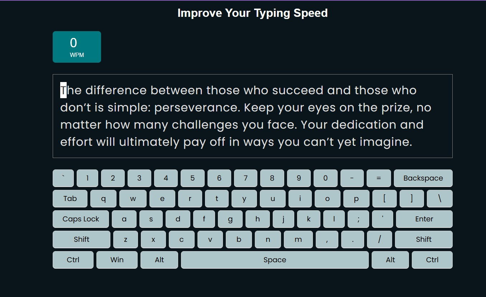

# Typing Practice App

A simple typing practice app built with vanilla JavaScript to help you improve your typing speed and accuracy. The app provides a typing challenge where you can practice typing random sentences and track your performance in real time.

## Features

- **Real-Time Typing Challenge**: Test your typing speed and accuracy with dynamically generated text.
- **Performance Tracker**: Monitor your typing speed (WPM) and accuracy as you type.
- **Minimalistic Design**: Clean, user-friendly interface built using only HTML, CSS, and vanilla JavaScript.
- **No Dependencies**: Completely built with plain JavaScript, no external libraries or frameworks.

## How It Works

1. The app presents a typing challenge with random text.
2. Start typing the text as fast and accurately as you can.
3. The app tracks your **Words Per Minute (WPM)** and **accuracy** in real time.
4. After completing the challenge, the app provides your final statistics.

## Demo

[Visit the Typing Practice App](https://mr-typer.vercel.app/)
